Data Visualization Chapter 3
================

## GitHub Documents

This is an R Markdown format used for publishing markdown documents to
GitHub. When you click the **Knit** button all R code chunks are run and
a markdown file (.md) suitable for publishing to GitHub is generated.

## Including Code

You can include R code in the document as follows:

``` r
library(gapminder)
library(ggplot2)
library(here)
```

    ## here() starts at G:/My Drive/Mathematics/data-visualization-git

``` r
# gapminder
p <- ggplot(data = gapminder, mapping = aes(x = gdpPercap, y = lifeExp))
p + geom_point()
```

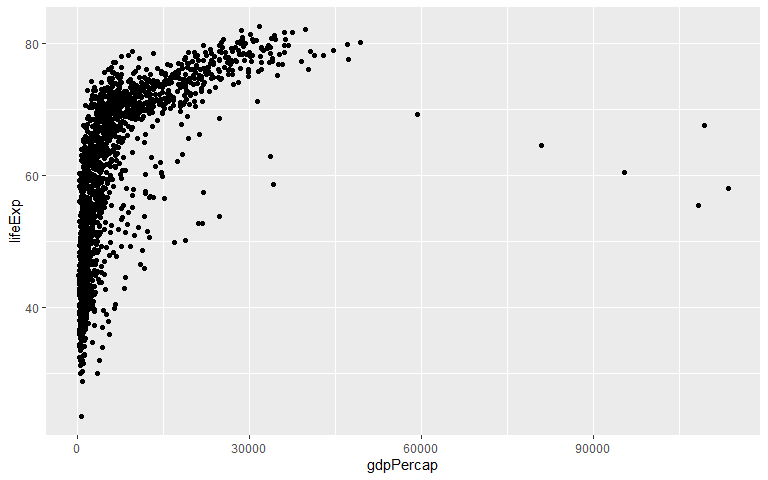<!-- -->

``` r
p + geom_smooth()
```

    ## `geom_smooth()` using method = 'gam' and formula = 'y ~ s(x, bs = "cs")'

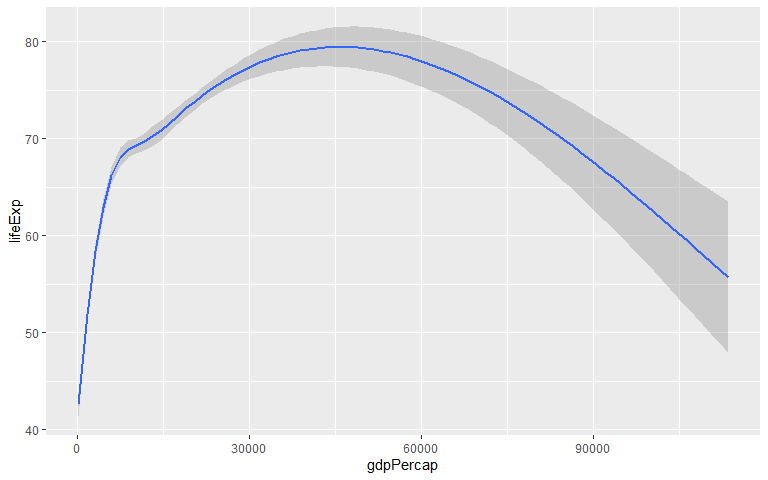<!-- -->

``` r
p + geom_point() + geom_smooth()
```

    ## `geom_smooth()` using method = 'gam' and formula = 'y ~ s(x, bs = "cs")'

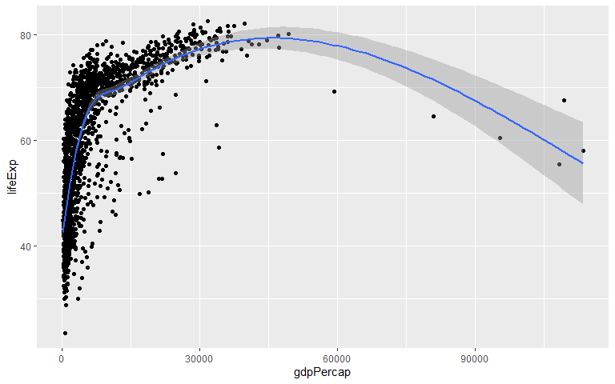<!-- -->

``` r
p + geom_point() + geom_smooth(method = "lm")
```

    ## `geom_smooth()` using formula = 'y ~ x'

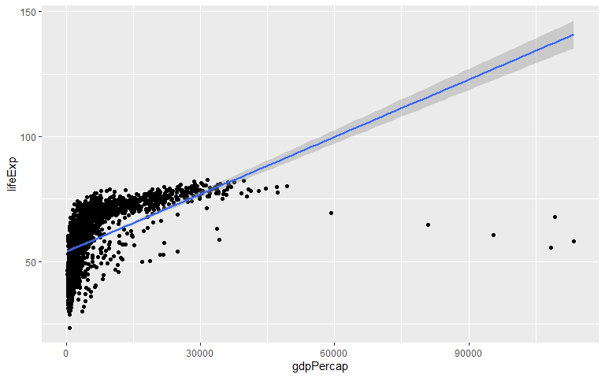<!-- -->

``` r
p + geom_point() + geom_smooth(method = "gam") + scale_x_log10()
```

    ## `geom_smooth()` using formula = 'y ~ s(x, bs = "cs")'

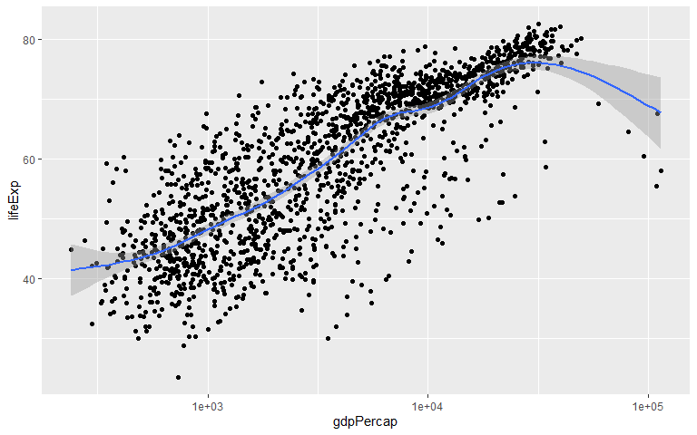<!-- -->

``` r
p + geom_point() + geom_smooth(method = "gam") + scale_x_log10(labels = scales::dollar)
```

    ## `geom_smooth()` using formula = 'y ~ s(x, bs = "cs")'

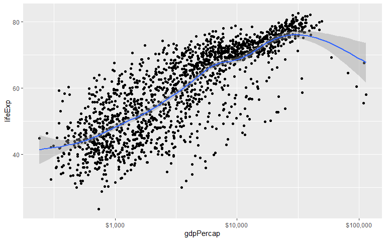<!-- -->

``` r
p + geom_point(color = "purple") + geom_smooth(method = "loess") + scale_x_log10()
```

    ## `geom_smooth()` using formula = 'y ~ x'

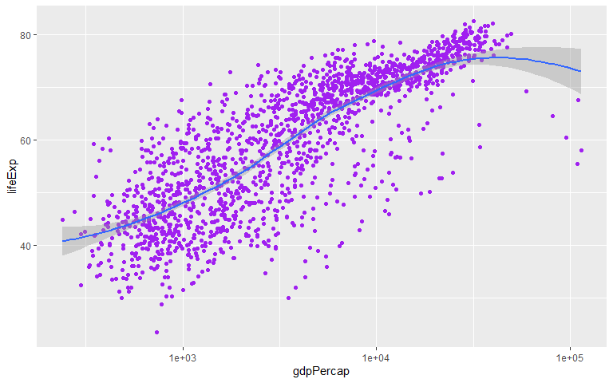<!-- -->

``` r
p + geom_point(alpha = 0.3) + geom_smooth(color = "orange", se = FALSE, size = 8, method = "lm") + scale_x_log10()
```

    ## Warning: Using `size` aesthetic for lines was deprecated in ggplot2 3.4.0.
    ## ℹ Please use `linewidth` instead.
    ## This warning is displayed once every 8 hours.
    ## Call `lifecycle::last_lifecycle_warnings()` to see where this warning was
    ## generated.

    ## `geom_smooth()` using formula = 'y ~ x'

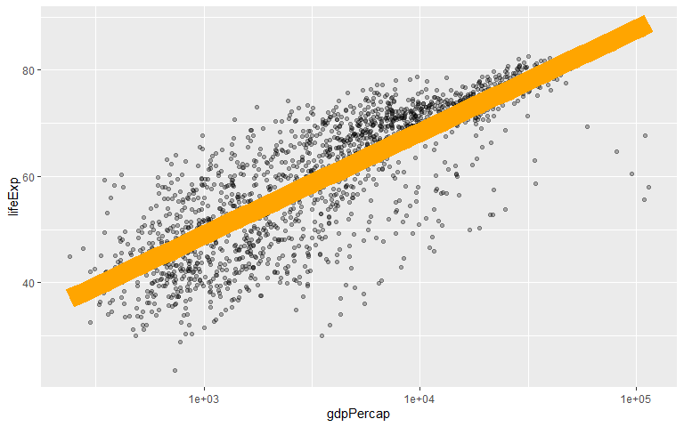<!-- -->

``` r
# se = standard error
p + geom_point(alpha = 0.3) + geom_smooth(method = "gam") + scale_x_log10(labels = scales::dollar) +
  labs(x = "GDP Per Capita", y = "Life Expectancy in Years", title = "Economic Growth and Life Expectancy", 
       subtitle = "Data points are country-years",
       caption = "Source: Gapminder.")
```

    ## `geom_smooth()` using formula = 'y ~ s(x, bs = "cs")'

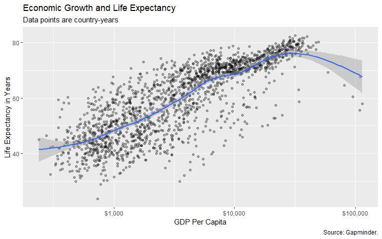<!-- -->

``` r
p <- ggplot(data = gapminder, mapping = aes(x = gdpPercap, y = lifeExp, color = continent, fill = continent))
p + geom_point() + geom_smooth(method = "loess") + scale_x_log10()
```

    ## `geom_smooth()` using formula = 'y ~ x'

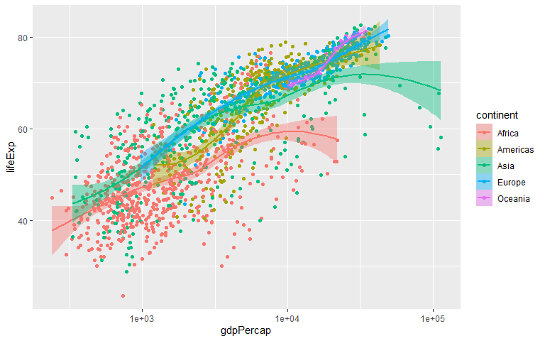<!-- -->

``` r
p <- ggplot(data = gapminder, mapping = aes(x = gdpPercap, y = lifeExp))
p + geom_point(mapping = aes(color = log(pop))) + scale_x_log10()
```

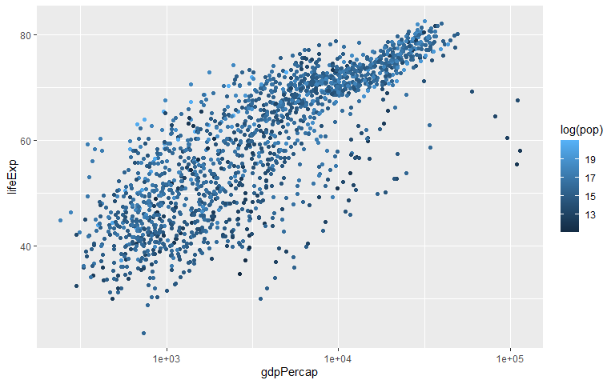<!-- -->

``` r
p.out <- p + geom_point() + geom_smooth(method = "loess") + scale_x_log10()
ggsave(here("figures","lifeexp_vs_gdp_gradient.png"), plot = p.out)
```

    ## Saving 8 x 5 in image

    ## `geom_smooth()` using formula = 'y ~ x'

## Including Plots

You can also embed plots, for example:

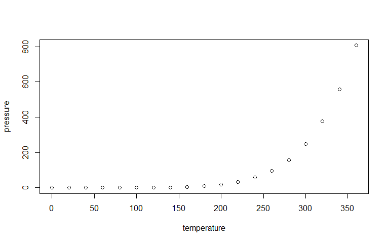<!-- -->

Note that the `echo = FALSE` parameter was added to the code chunk to
prevent printing of the R code that generated the plot.
